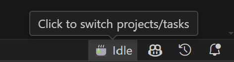
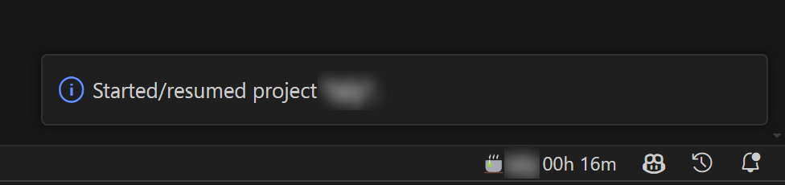
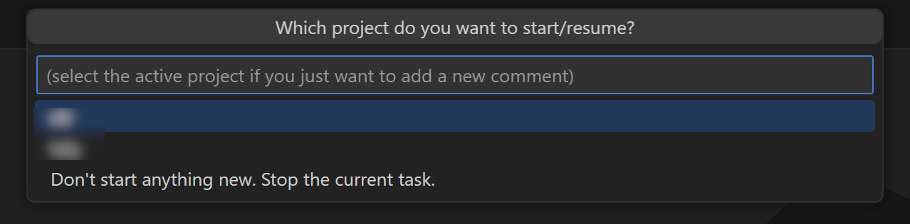

# CoffeeCup VSCode Extension

This extension adds time tracking from coffeecup.app to VSCode. Requires the CoffeeCup CLI to be installed and functional. See [Requirements](#requirements).

## Features

- Show the state and duration of your currently active task

  Idle:\
  

  Active:\
  

- Change your active task

  

## Requirements

To run this, you need to have the CoffeeCup CLI installed. Get it from here: https://github.com/fischeversenker/coffeecup-cli.
You need to be logged in using the CLI and you can only use tasks from projects for which you have set up an alias using `coffeecup projects alias`. See the CoffeeCup CLI repository for more details.
